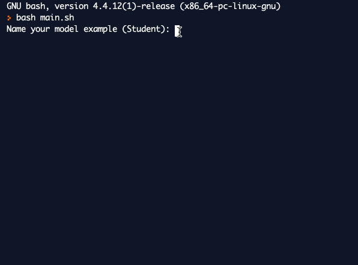

# STREAK
Streak allows users to generate a full Spring API from the command line.

## Usage
- Download the `streak.sh` bash script to your computer.
- Run the script `./streak.sh`.
- Create the API model by adding each property like below:

- Finish by typing `end` and press enter
- Viola

*NB* Recommend running in [repl.it Bash Environment](https://repl.it/languages/bash) online environment for now to overcome `bad substitution bug`. Fix incoming (online app too).
